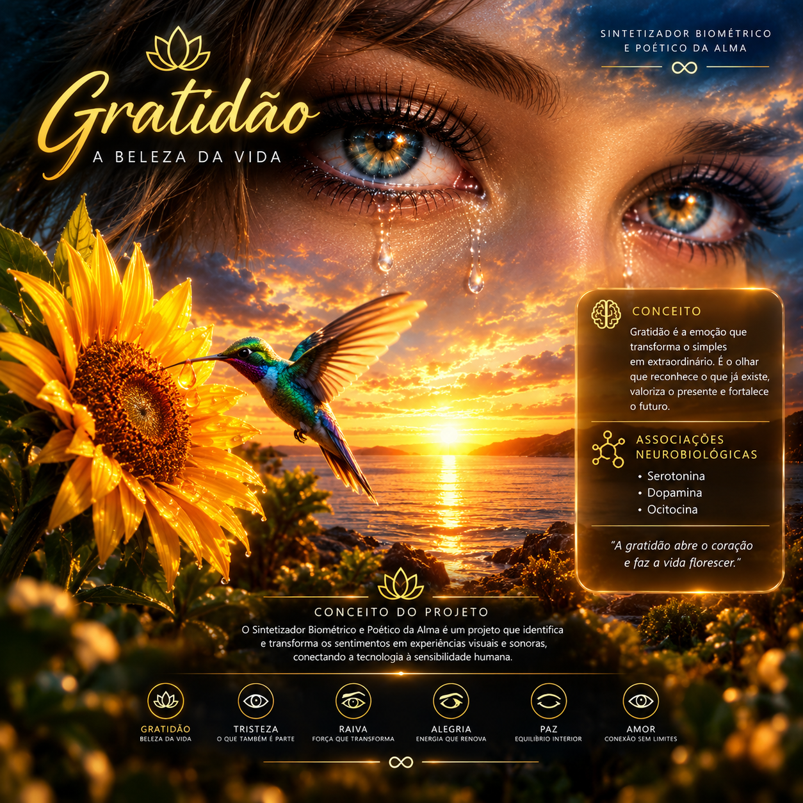

# ⚡ PROJETO 5º ELEMENTO — Ecossistema Unificado

> **Sintetizador Biométrico e Poético da Alma**  
> *Uma plataforma interativa que conecta hardware, inteligência artificial e sensibilidade humana para traduzir sinais fisiológicos em arte, poesia e autoconhecimento.*

---

---

## 🌐 Portais do Ecossistema Web

* 🧮 **Balanço Energético Embarcado:** [donicatia1206.github.io/donicatia1206](https://donicatia1206.github.io/donicatia1206/)
* 🤖 **Sintetizador Biométrico (IA / Console):** [donicatia1206.github.io/CAPTAIN_PLANET_PROJECT](https://donicatia1206.github.io/CAPTAIN_PLANET_PROJECT/)
* 🎨 **Portais da Alma (Mosaico Poético):** [donicatia1206.github.io/lagrimas_emocionais](https://donicatia1206.github.io/lagrimas_emocionais/)

---

## 🧬 Como Funciona a Leitura Biométrica (Hardware & Algoritmo)

O sistema analisa dois biomarcadores fundamentais transmitidos pelos sensores do microcontrolador (ESP32):

### 1. Batimentos Por Minuto (BPM)
* **Captura no Hardware:** Utiliza sensores ópticos PPG (ex: MAX30102 / PulseSensor) via LED e fotodiodo para medir variações na microcirculação sanguínea a cada pulso.
* **Mapeamento Emocional:**
  * `< 65 BPM`: Repouso profundo e meditação (**PAZ 🕊️**)
  * `65 - 85 BPM`: Equilíbrio e presença (**GRATIDÃO 🌻** / **TRISTEZA 🌧️**)
  * `85 - 110 BPM`: Entusiasmo ou comoção intensa (**ALEGRIA ✨** / **DOR DA ALMA 💧**)
  * `> 120 BPM`: Descarga de adrenalina e melhoria (**RAIVA 🔥**)

### 2. Nível de Estresse (0 - 100)
* **Variabilidade da Frequência Cardíaca (HRV):** Mede os intervalos em milissegundos entre batimentos cardíacos (intervalo RR).
  * *Alta variação (HRV alta):* Sistema parassimpático ativo (Corpo relaxado / Baixo estresse).
  * *Baixa variação (HRV regulação):* Sistema simpático ativo (Resposta de luta/fuga / Alto estresse).
* **Resposta Galvânica da Pele (GSR / EDA):** Mede a microcondutividade elétrica da pele produzida pelas glândulas sudoríparas durante variações emocionais.

---

## 🛠️ Arquitetura do Sistema

* **Front-end:** HTML5, CSS3, JavaScript (Hospedado no GitHub Pages)
* **API de back-end:** Python / Flask / Flask-CORS (Hospedado no Render)
* **Microcontrolador:** ESP32-C3 com sensores PPG e GSR

---

  <i>"Porque sentir também é viver..."</i> ♾️

